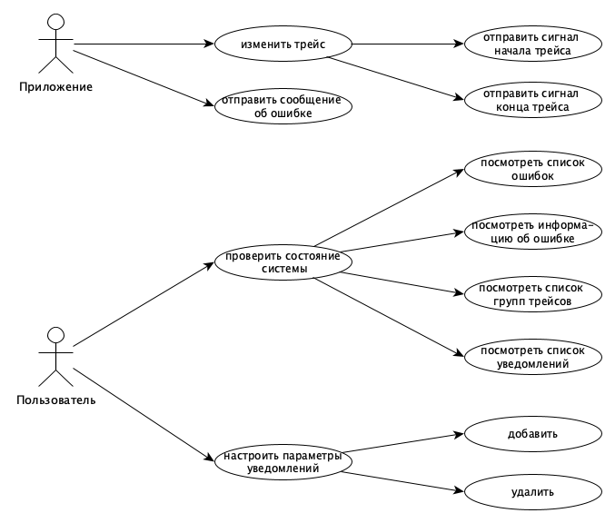
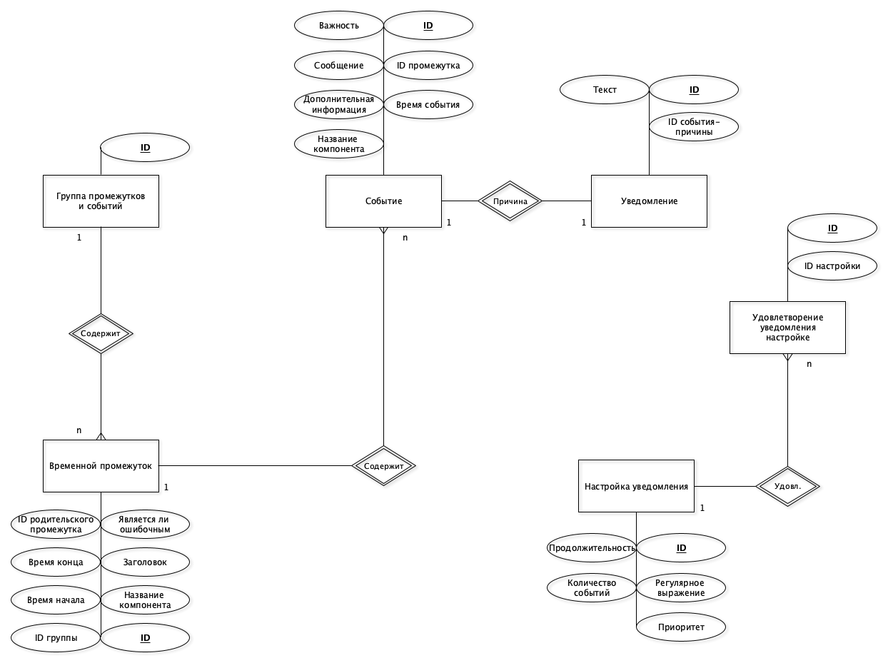
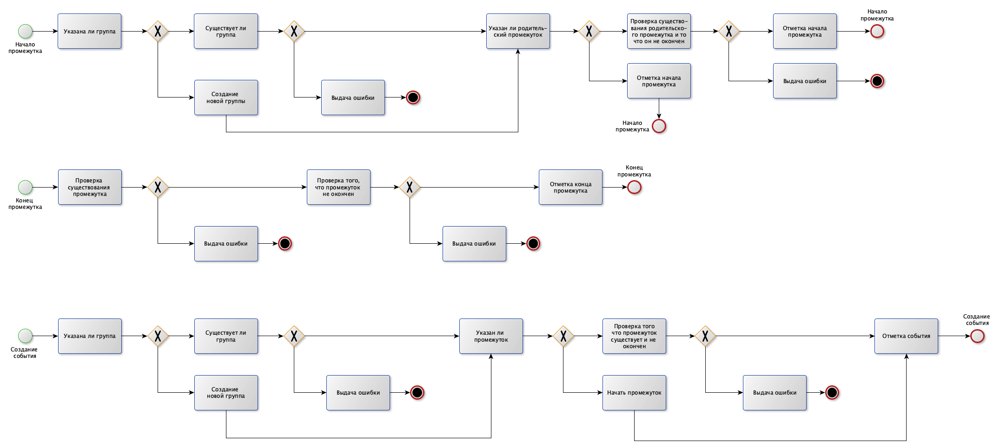
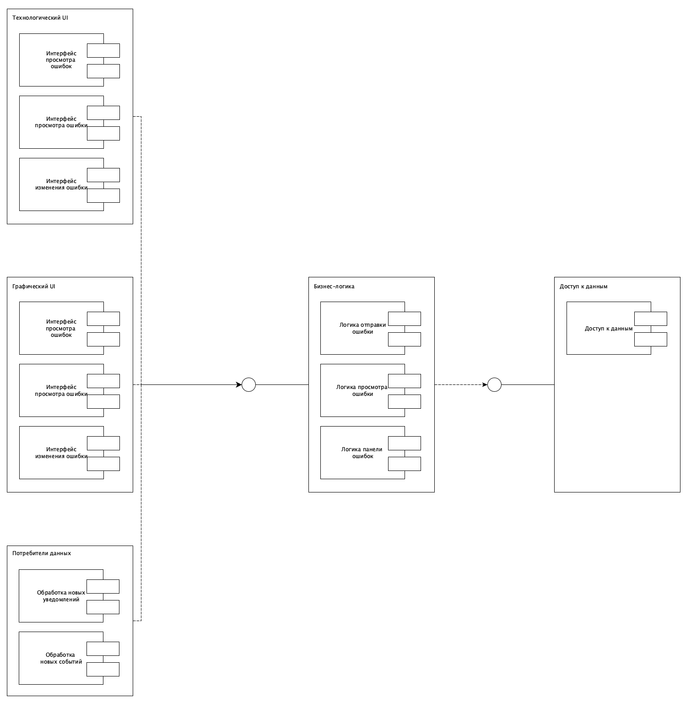
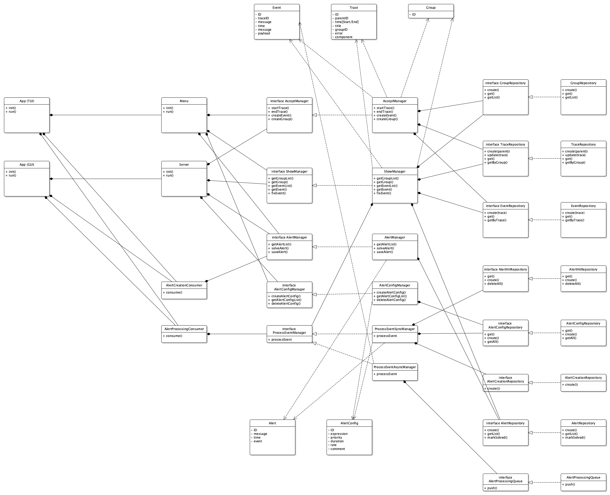
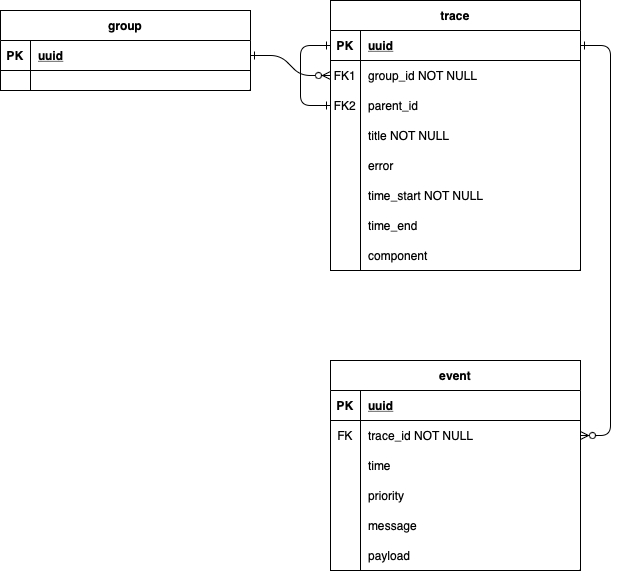

# xatosiz

## Краткое описание идеи проекта
Система, позволяющая отслеживать ошибки в приложениях. 
Приложение может отправлять информацию о событиях 
(ошибках и просто информационных), и в панели управления 
можно просматривать информацию об этих ошибках. Кроме того, 
поддерживается отображения ошибок в соответствии с их приоритетом.
При просмотре информации об ошибке можно просмотреть 
трейсы приложения.

## Краткое описание предметной области
В процессе эксплуатации приложений часто возникает потребность в 
отслеживании ошибок. При этом надо не только узнать о факте ошибки,
но и уметь на него своевременно среагировать, то есть
факт ошибки должен быть сразу понятен, и должна быть дана 
максимальная информация об ошибке. Для дополнительной информации о 
работе системы часто используются трейсы.

## Краткий анализ аналогичных решений по 3 критериям

|                                 | Sentry       | Jaeger    | Uptrace   | xatosiz |
|---------------------------------|--------------|-----------|-----------|---------|
| Трейсы                          | Да           | Да        | Да        | Да      |
| Отображение ошибок              | Да           | Нет       | Нет       | Да      |
| Сложность установки и поддержки | Очень сложно | Нормально | Нормально | Просто  |

## Краткое обоснование целесообразности и актуальности проекта
Проект актуален, так как практически не существует средства, 
совмещающих в себе трейсинг и удобное отслеживание ошибок.
Те средства, которые все же могут это совмещать, крайне сложны
и дороги в установке и поддержке.

## Use-Case - диаграмма

## ER-диаграмма сущностей

## Пользовательские сценарии
Приложение может начать новое действие, или использовать текущее
действие. В результате начала действия (или присоединения)
приложение получает идентификатор действия. На основе него приложение
может создавать трейсы и события. Одно действие может
распространяться на многие компоненты системы, составляя при этом целостную
картину.

При входе в аккаунт, пользователь может посмотреть список событий.
При этом, события отображаются в порядке их важности – от
критичных к информационным. При нажатии на событие,
пользователь получает подробную информацию о нем: информационные поля, 
заголовок ошибки, время ошибки. Кроме того, пользователь может просмотреть
трейсы, связанные с событием.

## Формализация бизнес-правил

## Технологический стек
- Тип приложения: Web SPA
- Бэкенд: Go
- Фронтенд: Vue
- БД: PostgreSQL

## Диаграмма компонентов

## Диаграмма классов

## ER-диаграмма базы данных
